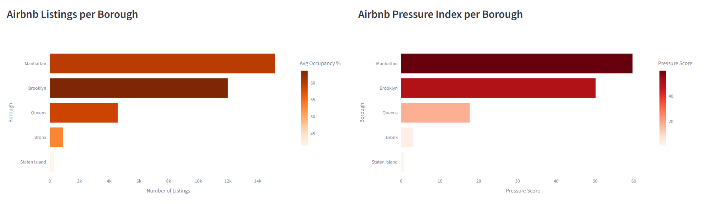
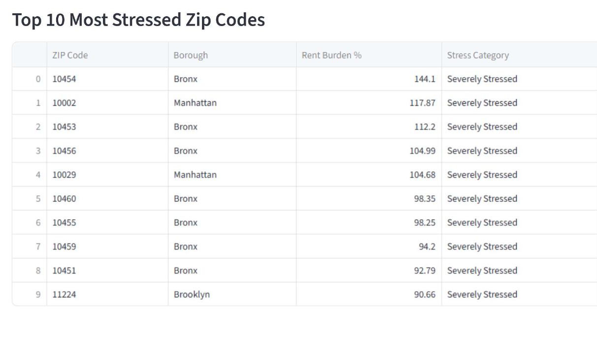

# NYC Rental Stress Observatory

> A fully autonomous Big Data pipeline that measures how Airbnb short-term rentals affect housing affordability across New York City — from raw public data to an interactive dashboard, launched with a single `docker-compose up`.

**Course:** Big Data Technologies 2025/2026 · Università degli Studi di Trento
**Authors:** Alessia Ronchetti · Giorgia Mazzarello · Mohamed Amine El Hani

---

## Table of Contents

1. [Description](#description)
2. [Abstract](#abstract)
3. [Why This Is a Big Data Problem](#why-this-is-a-big-data-problem)
4. [Architecture at a Glance](#architecture-at-a-glance)
5. [Technologies Used](#technologies-used)
6. [Project Structure](#project-structure)
7. [Setup & Configuration](#setup--configuration)
8. [Data Sources](#data-sources)
9. [Medallion Architecture](#medallion-architecture)
10. [Silver Tables Schema](#silver-tables-schema)
11. [Gold Tables Schema](#gold-tables-schema)
12. [Indices and Methodology](#indices-and-methodology)
13. [Pipeline Components](#pipeline-components)
14. [Docker Services](#docker-services)
15. [Dashboard](#dashboard)
16. [Key Results](#key-results)
17. [Known Issues & Solutions](#known-issues--solutions)
18. [Limitations & Future Work](#limitations--future-work)
19. [Troubleshooting](#troubleshooting)
20. [Acknowledgments & GenAI Disclosure](#acknowledgments--genai-disclosure)
21. [License](#license)

---

## Description

The **NYC Rental Stress Observatory** is a fully autonomous Big Data system that monitors the impact of short-term rentals (Airbnb) on housing affordability in New York City. With a single `docker-compose up`, the system downloads data, processes it through a medallion architecture, and serves an interactive Streamlit dashboard — with no manual intervention.

## Abstract

The system combines four public data sources (Inside Airbnb, Zillow, US Census ACS, NYC Open Data) to quantify how the proliferation of Airbnb listings reduces the supply of long-term housing and pushes rents up. Data is landed in an S3-compatible data lake (MinIO) and refined through a **Bronze → Silver → Gold** pipeline using Apache Spark and Apache Sedona (for geospatial joins between Airbnb coordinates and ZIP-code polygons). The aggregated Gold metrics are written to PostgreSQL, which acts as the serving layer for the dashboard.

The whole pipeline is event-driven: a scraper publishes Kafka events when new data appears, and a debounced Kafka consumer triggers the ETL automatically. All seven services are orchestrated with Docker Compose.

The final output is a set of rental stress metrics per ZIP code and borough — rent burden %, occupancy rate, and an Airbnb Pressure Index — visualized in a web dashboard.

---

## Why This Is a Big Data Problem

| Dimension | In this project |
|---|---|
| **Volume** | 36,445 Airbnb listings and **13M+ calendar rows** (365 days × listings), plus multiple administrative datasets, aggregated down to ZIP/borough level. |
| **Variety** | Compressed CSV (Airbnb), monthly time-series CSV (Zillow), JSON from the Census API, GeoJSON polygons (NYC Open Data), and Parquet intermediate outputs. |
| **Velocity** | Event-driven refresh: the scraper checks every 24h and a Kafka event triggers a full re-processing automatically when new data lands. |
| **Complexity** | Cleaning, type casting, null handling, multi-source joins, a **geospatial join** (point-in-polygon over 441 polygons), aggregations, and dashboard serving. |

No single dataset captures rent, income, Airbnb activity *and* geography together — the value of the project is in integrating them into one reproducible pipeline.

---

## Architecture at a Glance

```
                         ┌──────────────────────────────────────────────┐
   DATA SOURCES          │                 INGESTION                     │
 ┌─────────────────┐     │   scraper.py  ──(Kafka event)──▶  consumer    │
 │ Inside Airbnb   │     │   (every 24h)   pipeline.file-events  (60s    │
 │ Zillow ZORI     │────▶│                                  debounce)    │
 │ US Census ACS5  │     └───────────────────────┬──────────────────────┘
 │ NYC Open Data   │                             │ triggers
 └─────────────────┘                             ▼
                              ┌──────────────────────────────────────┐
                              │     run_pipeline.py (orchestrator)    │
                              └──────────────────────────────────────┘
                                  │            │              │
                                  ▼            ▼              ▼
                            ingestion.py  processing.py    serving.py
                                  │            │              │
                                  ▼            ▼              ▼
                          ┌──────────────────────────────┐  ┌─────────────┐
                          │           MinIO               │  │ PostgreSQL  │
                          │  Bronze ─▶ Silver ─▶ Gold      │─▶│  5 tables   │
                          │  (raw)    (clean)   (agg.)     │  └──────┬──────┘
                          └──────────────────────────────┘         │
                                                                    ▼
                                                          ┌──────────────────┐
                                                          │ Streamlit dash.  │
                                                          │ localhost:8501   │
                                                          └──────────────────┘

       All 7 services orchestrated by Docker Compose  ·  docker-compose up -d
```

---

## Technologies Used

| Technology | Role |
|---|---|
| **Docker + Docker Compose** | Orchestrates all seven services with a single command |
| **Apache Kafka** (Confluent 7.5.0) | Event-driven trigger; messages retained 7 days for replay after crash |
| **Apache Zookeeper** | Kafka coordinator (broker registry, leader election, metadata) |
| **Apache Spark 3.5.0** (PySpark) | Distributed processing engine for Bronze → Silver → Gold transformations |
| **Apache Sedona 1.7.0** | Extends Spark with geospatial functions (`ST_Point`, `ST_Within`) |
| **MinIO** | S3-compatible object storage used as the data lake |
| **PostgreSQL 15** | Relational serving layer holding aggregated tables |
| **Streamlit** | Interactive web dashboard, refreshes via a 5-minute cache TTL |

---

## Project Structure

```text
Rental-Stress-Observatory/
├── docker-compose.yml              # Defines all 7 services
├── .env                            # Secret keys and environment variables (not committed)
├── runtime_results.csv             # Per-stage runtime benchmark (output of measure_runtime.py)
├── .gitignore
├── README.md
│
├── pipeline/                       # Autonomous data pipeline
│   ├── __init__.py
│   ├── config.py                   # Environment variables and constants
│   ├── scraper.py                  # Downloads data and publishes Kafka events
│   ├── ingestion.py                # Uploads raw files to MinIO Bronze
│   ├── processing.py               # Spark: Bronze → Silver → Gold
│   ├── serving.py                  # Spark: Gold Parquet → PostgreSQL
│   ├── run_pipeline.py             # Orchestrates ingestion + processing + serving
│   ├── pipeline_consumer.py        # Kafka consumer with 60s debounce logic
│   ├── start.py                    # Entry point: launches scraper + consumer threads
│   └── measure_runtime.py          # Measuring pipeline runtime
│
├── app/
│   ├── dashboard.py                # Streamlit dashboard
│   └── .ipynb_checkpoints/
│
├── streamlit_app/                  # Additional Streamlit app folder
│
├── data/raw/                       # Local raw data downloaded by scraper
│   ├── listings_NY.csv.gz
│   ├── calendar_NY.csv.gz
│   ├── census_income.csv
│   ├── census_population.csv
│   ├── zillow_rent.csv
│   ├── Zip_zori_uc_sfrcondomfr_sm_month.csv
│   └── .scraper_state.json
│
├── minio_data/                     # Local persistent volume for MinIO object storage
│
├── spark_jars/                     # Required JAR dependencies for Spark/Sedona/PostgreSQL
│   ├── aws-java-sdk-bundle-1.12.262.jar
│   ├── hadoop-aws-3.3.4.jar
│   ├── geotools-wrapper-1.6.1-28.2.jar
│   ├── postgresql-42.6.0.jar
│   └── sedona-spark-shaded-3.5_2.12-1.7.0.jar
│
├── notebooks/                      # Jupyter notebooks for exploration and validation
│   ├── 00_ingestion.ipynb
│   ├── 01_processing.ipynb
│   ├── 02_serving_layer.ipynb
│   └── .ipynb_checkpoints/
│
└── images/                         # Dashboard screenshots and README visual assets
```
---

## Setup & Configuration

### Prerequisites

- [Docker Desktop](https://www.docker.com/products/docker-desktop/) installed and running
- A free [US Census API key](https://api.census.gov/data/key_signup.html)
- ~4 GB of free disk space (MinIO stores all three medallion layers on the host disk)

### How to Run

1. **Clone the repository:**

```sh
git clone https://github.com/AlessiaRonchetti/Rental-Stress-Observatory.git
cd Rental-Stress-Observatory
```

2. **Create your `.env` file** with the Census API key:

```sh
echo "CENSUS_API_KEY=your_key_here" > .env
```

3. **Start all services:**

```sh
docker-compose up -d
```

4. **Watch the pipeline** (first run takes ~15–30 min: it downloads JARs and processes the data):

```sh
docker logs -f pipeline-runner
```

5. **Open the dashboard** at [http://localhost:8501](http://localhost:8501). It shows *"Data not available yet"* until the pipeline completes, then refreshes automatically as the cache expires.

### Other Endpoints

| Service | URL | Credentials |
|---|---|---|
| MinIO console | http://localhost:9001 | `admin` / `password123` |
| JupyterLab | http://localhost:8888 | token: `bigdata123` |
| Spark UI | http://localhost:4040 | — |

> The credentials above are **demo values** hard-coded for local use only. Do not reuse them in any non-local or production deployment.

### Running the Pipeline Manually

By default the pipeline runs **automatically**: the scraper downloads data, publishes a Kafka event, and the debounced consumer triggers `run_pipeline.run()`. You normally never call anything by hand.

For testing, debugging, or to force a run **without waiting for the 24h scraper cycle or the Kafka trigger**, you can execute the scripts directly inside the already-running `pipeline-runner` container with `docker exec`. Each pipeline module is an independent Python script with its own `if __name__ == "__main__"` entry point, so it can be run on its own.

> All paths below are **inside the container**: `/opt/conda/bin/python` is the interpreter from the PySpark image (the one with all dependencies installed), and `/app` is the project root mounted via the `.:/app` volume. The `-it` flags give you a TTY so you see the logs live. The `pipeline-runner` container must already be up (`docker-compose up -d`).

**Run the full pipeline** (ingestion → processing → serving), bypassing Kafka:

```sh
docker exec -it pipeline-runner /opt/conda/bin/python /app/pipeline/run_pipeline.py
```

**Run a single step** in isolation:

```sh
# Step 1 — upload local data/raw/ files to MinIO Bronze
docker exec -it pipeline-runner /opt/conda/bin/python /app/pipeline/ingestion.py

# Step 2 — Bronze → Silver → Gold (Spark + Sedona)
docker exec -it pipeline-runner /opt/conda/bin/python /app/pipeline/processing.py

# Step 3 — Gold (MinIO) → PostgreSQL (Spark JDBC)
docker exec -it pipeline-runner /opt/conda/bin/python /app/pipeline/serving.py
```

> **Note on `run_pipeline.py` vs single steps:** `run_pipeline.py` executes `processing` and `serving` **in the same Python process**, so they share one JVM. The JVM classpath is fixed at the first `getOrCreate()` (in `processing`), which is why **every JAR needed by any step — including `postgresql-42.6.0.jar` — must be present in `processing.py`'s JAR list**, not only in `serving.py`. Run as standalone scripts, each module gets a **fresh JVM** and loads its own JARs, so `serving.py` works on its own even if only its local JAR list contains the Postgres driver. If `run_pipeline.py` fails at the serving step with `ClassNotFoundException: org.postgresql.Driver`, this shared-JVM classpath is the cause (see [Known Issues](#known-issues--solutions)).

**Run the scraper on demand.** The scraper is the **trigger**, not an ETL step: it checks the sources, downloads any new data into `data/raw/`, and — if at least one source changed — publishes a Kafka event that makes the consumer launch the full pipeline. This is the *natural* way to manually kick off the automatic path end-to-end.

```sh
# One single check-and-download cycle, then exit (recommended for manual use).
# Downloads new data and publishes a Kafka event if anything changed.
docker exec -it pipeline-runner /opt/conda/bin/python -c "from pipeline.scraper import run_once; run_once()"
```

Running the module directly instead starts the **continuous loop** (`run_once()` immediately, then sleep `CHECK_INTERVAL_HOURS`, forever) — i.e. exactly what the container already does at startup via `start.py`:

```sh
# Continuous loop — blocks the terminal. Note: a scraper is ALREADY running
# inside the container (start.py), so this launches a SECOND instance.
docker exec -it pipeline-runner /opt/conda/bin/python /app/pipeline/scraper.py
```

> **Idempotency:** the scraper keeps `data/raw/.scraper_state.json` to remember what it already downloaded. If nothing changed since the last run it logs `No updates found - pipeline not triggered` and publishes **no** event. To force a fresh download + trigger, delete the state file first:
> ```sh
> docker exec -it pipeline-runner rm -f /app/data/raw/.scraper_state.json
> ```

### Reset Everything

Stops all services and deletes all data:

```sh
docker-compose down -v && rm -rf minio_data/ data/raw/ spark_jars/
```

---

## Data Sources

| Source | What it provides | Format | URL |
|---|---|---|---|
| **Inside Airbnb** | Listings (lat/lon, room type) + Calendar (daily availability) | CSV (.gz) | [data.insideairbnb.com](https://data.insideairbnb.com) |
| **Zillow ZORI** | Market rent index per ZIP code, one column per month | CSV | [files.zillowstatic.com](https://files.zillowstatic.com) |
| **US Census ACS5** | Median household income + population per ZIP code (5-year estimates) | JSON API → CSV | [api.census.gov](https://api.census.gov) |
| **NYC Open Data** | GeoJSON polygons of NYC ZIP code boundaries (MODZCTA) | GeoJSON | [data.cityofnewyork.us](https://data.cityofnewyork.us) |

> **Note on the Airbnb price field:** the `price` column is null across the entire NYC Inside Airbnb dataset, so market rent is **proxied via Zillow ZORI** (a ZIP-level monthly index) rather than computed from listing prices.

> **Note on geographic scope:** the Census API is queried for **all US ZIP codes** (`zip code tabulation area:*`), then Zillow is filtered to `State == "NY"`. The inner join of the three economic datasets therefore yields **441 New York-state ZIP codes** with complete rent + income data — this is the basis of the `market_rental_stress` table. The Airbnb spatial join and the heatmap are instead restricted to **NYC ZIP polygons** (MODZCTA, NYC Open Data). This deliberate scope mismatch is documented under [Limitations](#limitations--future-work).

---

## Medallion Architecture

Data flows through three layers stored in MinIO, in increasing quality. The key advantage is the **immutability of Bronze**: raw data is never modified, so the pipeline can be re-run from Bronze after a bug fix without re-downloading anything.

| Layer | Format | Content | Written by |
|---|---|---|---|
| **Bronze** (raw) | CSV (.gz) | Files exactly as downloaded, no transformation | `ingestion.py` |
| **Silver** (cleaned) | Parquet | Typed, deduplicated, nulls handled, `GEO_ID → ZIP`, occupancy aggregated | `processing.py` |
| **Gold** (aggregated) | Parquet → PostgreSQL | Business metrics ready for the dashboard | `processing.py` + `serving.py` |

**Bronze files** (under `s3a://rental-observatory/bronze/`): `listings_NY.csv.gz`, `calendar_NY.csv.gz` (Inside Airbnb), `zillow_rent.csv` (Zillow ZORI), `census_income.csv` and `census_population.csv` (US Census ACS5). The NYC ZIP GeoJSON is **not** stored in Bronze — it is fetched at runtime by `processing.py` and cached in `/tmp`.

The Gold layer produces **five tables**, all written to PostgreSQL via Spark JDBC.

### Data flow: which files feed which layer

```
BRONZE (raw CSV)                SILVER (cleaned Parquet)            GOLD (aggregated Parquet → PostgreSQL)
──────────────────             ──────────────────────────         ───────────────────────────────────────
census_population.csv ───────▶ census_population/ ─┐
census_income.csv ───────────▶ census_income/ ─────┼─(inner join on zip_code)─▶ market_rental_stress
zillow_rent.csv ─────────────▶ zillow_rent/ ───────┘                                    │
                                                                                        │ (joined by ZIP
listings_NY.csv.gz ──┐                                                                  │  in spatial step)
                     ├──(inner join on listing_id)─▶ airbnb_listings_enriched/ ─┬──────▶ airbnb_borough_summary
calendar_NY.csv.gz ──┘                                                          ├──────▶ airbnb_pressure
                                                                                │
NYC ZIP GeoJSON (runtime, /tmp) ───────────────────(ST_Within spatial join)────┼──────▶ airbnb_listings_with_zip
                                                                                └──────▶ zip_airbnb_stress_summary
```

**Bronze → Silver** (clean & type each source independently, except Airbnb which is also joined):
- `census_population.csv` → `census_population/`
- `census_income.csv` → `census_income/`
- `zillow_rent.csv` → `zillow_rent/`
- `listings_NY.csv.gz` **+** `calendar_NY.csv.gz` → `airbnb_listings_enriched/` (inner join on `listing_id`)

**Silver → Gold** (join & aggregate into business metrics):
- `census_population/` **+** `census_income/` **+** `zillow_rent/` → **`market_rental_stress`** (inner join on `zip_code`, then rent burden + stress category)
- `airbnb_listings_enriched/` → **`airbnb_borough_summary`** and **`airbnb_pressure`** (aggregated per borough)
- `airbnb_listings_enriched/` **+** NYC ZIP GeoJSON **+** `market_rental_stress` → **`airbnb_listings_with_zip`** (Sedona `ST_Within` spatial join) and **`zip_airbnb_stress_summary`** (per-ZIP combined view)

---

## Silver Tables Schema

The Silver layer is produced by `processing.py`. Each raw Bronze source is read, cleaned, typed and deduplicated, then written back to MinIO as Parquet under `silver/`. Four Silver datasets are produced.

> **General rules applied to every source:** schema is inferred on read; CSVs are parsed with `multiLine`/`quote`/`escape` options so free-text Airbnb fields containing commas or newlines don't break rows; numeric fields are explicitly cast (no reliance on inferred types); rows with nulls in key columns are dropped (`dropna`). Output is **columnar Parquet**, which is 5–10× smaller than the source CSV and supports predicate pushdown for faster Gold reads.

### `census_population/` — population per ZIP

| Column | Type | Notes |
|---|---|---|
| `zip_code` | string | last 5 characters of `GEO_ID` (e.g. `860Z200US10001 → 10001`) |
| `total_population` | int | from `B01003_001E` |

**Processing:** extract ZIP via `substring(GEO_ID, -5, 5)`; strip every non-numeric character from the population value with `regexp_replace("[^0-9]","")`; empty results → `NULL`, otherwise cast to `int`; keep only the two columns; drop rows with any null.

### `census_income/` — median household income per ZIP

| Column | Type | Notes |
|---|---|---|
| `zip_code` | string | last 5 characters of `GEO_ID` |
| `median_income` | int | from `B19013_001E` — **annual** median household income (ACS5) |

**Processing:** identical cleaning to population — ZIP extracted from `GEO_ID`, non-numeric characters stripped, empty → `NULL` else cast to `int`, then `dropna`.

### `zillow_rent/` — market rent per ZIP

| Column | Type | Notes |
|---|---|---|
| `zip_code` | string | from `RegionName` |
| `market_rent` | float | latest monthly ZORI value available |

**Processing:** filter to `State == "NY"`; **dynamically detect the latest date column** by matching `YYYY-MM-DD` headers and taking the most recent one (instead of hardcoding a date — this avoids stale values); cast `RegionName → zip_code` and the latest column → `market_rent`; drop nulls.

### `airbnb_listings_enriched/` — one row per listing (listings ⋈ calendar)

| Column | Type | Notes |
|---|---|---|
| `listing_id` | bigint | from listings `id` |
| `neighbourhood_group_cleansed` | string | borough |
| `neighbourhood_cleansed` | string | neighbourhood |
| `latitude` / `longitude` | float | listing coordinates |
| `room_type` | string | entire home / private room / etc. |
| `accommodates` | int | guest capacity |
| `calculated_host_listings_count` | int | listings managed by the same host |
| `final_occupancy_rate` | float | `days_blocked / total_days`, rounded to 4 decimals |
| `days_available` / `days_blocked` / `total_days` | int | calendar counts behind the occupancy rate |

This table is the result of cleaning **two** sources and joining them:

**Listings cleaning** — drop rows with a non-castable `id`; drop listings with no borough (`neighbourhood_group_cleansed` null) or missing coordinates (cannot be mapped); cast `id → bigint`, lat/lon → `float`, `accommodates` and host count → `int`; keep only the geographic/demographic columns needed downstream. The `price` column is intentionally dropped — it is null across the entire NYC dataset, so rent is proxied via Zillow ZORI instead.

**Calendar cleaning & aggregation** — the calendar starts at ~13M rows (≈365 per listing):
1. Cast `listing_id → bigint` (drop invalid) and parse `date` with `to_date(…, "yyyy-MM-dd")`.
2. Convert the text `available` flag into numeric indicators: `available = "t" → is_available = 1`, `available = "f" → is_blocked = 1` (blocked = booked or host-blocked).
3. `groupBy(listing_id)` and sum the flags → `days_available`, `days_blocked`, `total_days`. This collapses ~13M rows down to ~36k (one per listing).
4. Keep only listings with **`total_days ≥ 300`** (incomplete coverage is unreliable) and compute `cal_occupancy_rate = days_blocked / total_days`.
5. Convert a `0.0` occupancy to `NULL` — a listing never blocked carries no usable demand signal.

**Join** — `calendar_silver INNER JOIN listings_silver ON listing_id`. Starting from the calendar side (already filtered to ≥300 days) and using an inner join keeps only listings that exist in **both** files with sufficient calendar coverage, which is what makes the occupancy rates statistically reliable.

---

## Gold Tables Schema

| Table | Built from | Grain | Key columns |
|---|---|---|---|
| `market_rental_stress` | `census_population/` + `census_income/` + `zillow_rent/` | one row per NY-state ZIP | `zip_code`, `median_income`, `market_rent`, `total_population`, `rent_burden_pct`, `stress_category` |
| `airbnb_borough_summary` | `airbnb_listings_enriched/` | one row per borough | `neighbourhood_group_cleansed`, `num_listings`, `avg_occupancy_pct`, `avg_host_listings`, `entire_home_pct` |
| `airbnb_pressure` | `airbnb_listings_enriched/` | one row per borough | `neighbourhood_group_cleansed`, `num_listings`, `avg_occupancy_pct`, `pressure_score` |
| `airbnb_listings_with_zip` | `airbnb_listings_enriched/` + GeoJSON | one row per listing | `listing_id`, `zip_code`, `neighbourhood_group_cleansed`, `latitude`, `longitude`, `room_type`, `final_occupancy_rate` |
| `zip_airbnb_stress_summary` | `airbnb_listings_with_zip` + `market_rental_stress` | one row per ZIP (combined view) | `zip_code`, `neighbourhood_group_cleansed`, `rent_burden_pct`, `stress_category`, `median_income`, `market_rent`, `num_airbnb_listings`, `avg_occupancy_pct`, `entire_home_pct` |

---

## Indices and Methodology

### 1. Rent Burden % (HUD standard)

Share of **annual** income spent on rent. `median_income` is the Census ACS5 *annual* median household income (variable `B19013_001E`); `market_rent` is the latest monthly Zillow ZORI value, multiplied by 12 to annualize:

```
rent_burden_pct = (market_rent × 12 / median_income) × 100
```

| Category | Threshold |
|---|---|
| Affordable | < 30% |
| Stressed | 30% – 49.9% |
| Severely Stressed | ≥ 50% |

> **Why some values exceed 100%:** Zillow ZORI is a *broad market-rent index*. In very low-income ZIP codes it can exceed what residents actually pay, producing rent-burden values above 100% (e.g. ZIP 10454 at 144%). The index should be read as a **relative pressure signal**, not the literal share of income spent on rent.

### 2. Occupancy Rate (per listing)

```
occupancy_rate = days_blocked / total_days        (requires ≥ 300 calendar days)
```

`available = "f"` in the calendar means the day is blocked (booked or host-blocked). Listings with fewer than 300 calendar days are excluded as unreliable, and a `0.0` rate is set to null (never-booked listings carry no signal).

> **Known limitation:** the calendar does not distinguish *booked* from *host-blocked* days, so the occupancy rate is an approximation of demand.

### 3. Airbnb Pressure Index (per borough)

Combines listing volume and occupancy utilization per borough. The listing count is normalized by the borough maximum (so the busiest borough gets 1.0 on that factor), then multiplied by the average occupancy percentage (0–100). The result is a **relative index** — higher means more pressure. It is **not** bounded to 0–1; its scale depends on the average occupancy percentage.

```
pressure_score = (num_listings / max_listings_across_boroughs) × avg_occupancy_pct
```

### 4. Entire Home %

```
entire_home_pct = (entire_home_listings / total_listings) × 100
```

Shows what share of a borough's Airbnb supply is fully removed from the long-term rental market (entire homes/apartments displace housing units in a way that private rooms do not). Visualized as a per-borough bar chart in the dashboard.

---

## Pipeline Components

### Pipeline (autonomous ETL)

- **`config.py`** — Central configuration read from environment variables (Kafka/MinIO hosts, topic, 60s debounce, Census key, JDBC properties).
- **`scraper.py`** — Checks each source every 24h and downloads only changed files. Resolves the dynamic Zillow URL via BeautifulSoup, picks the most recent joinable Inside Airbnb release (see the validation step below), and publishes a Kafka event on `pipeline.file-events`. Keeps `.scraper_state.json` for idempotency.
- **`ingestion.py`** — Uploads raw files from `data/raw/` to MinIO under `bronze/`.
- **`processing.py`** — Spark job for Silver and Gold. Cleans and types the data, runs the Sedona spatial join (`ST_Within`) to assign each listing a ZIP code, and computes the Gold metrics. Downloads required JARs (`hadoop-aws`, `aws-sdk`, `sedona`, `geotools`) at runtime. The NYC ZIP GeoJSON is fetched here at runtime and cached in `/tmp` — *not* via the scraper.
- **`serving.py`** — Reads Gold Parquet from MinIO and writes the five tables to PostgreSQL via Spark JDBC (`.mode("overwrite")`, full-table replace).
- **`run_pipeline.py`** — Orchestrates ingestion → processing → serving; aborts on the first failure to avoid partial writes.
- **`pipeline_consumer.py`** — Kafka consumer that triggers the pipeline after 60s of silence (debounce), batching bursts of events into a single run.
- **`start.py`** — Container entry point; launches the scraper and consumer as daemon threads.

### Event flow

```
scraper finds new data ─▶ Kafka event ─▶ consumer waits 60s (debounce)
                                              │
                                              ▼
                          run_pipeline: ingestion ─▶ processing ─▶ serving
```

The 60s debounce matters because the scraper may download several files at once (e.g. listings + calendar + Zillow), each producing an event. Debouncing collapses that burst into a **single** pipeline run instead of three parallel ones.

---

## Docker Services

| Service | Image | Port | Role |
|---|---|---|---|
| `zookeeper` | `cp-zookeeper:7.5.0` | 2181 | Kafka coordinator |
| `kafka` | `cp-kafka:7.5.0` | 9092 | Message broker (`pipeline.file-events`), 7-day retention |
| `minio` | `minio/minio:latest` | 9000 / 9001 | S3-compatible data lake |
| `postgres` | `postgres:15` | 5432 | Serving layer for the dashboard |
| `pyspark` | `jupyter/pyspark-notebook` | 8888 / 4040 | Interactive Spark / JupyterLab |
| `pipeline-runner` | `jupyter/pyspark-notebook` | — | Runs `start.py` (scraper + consumer) |
| `frontend` | `python:3.9-slim` | 8501 | Streamlit dashboard |

---

## Dashboard

The Streamlit dashboard (`app/dashboard.py`) reads exclusively from PostgreSQL and refreshes via a 5-minute cache TTL (`@st.cache_data(ttl=300)`). On load it runs four `SELECT * FROM …` queries — `zip_airbnb_stress_summary`, `airbnb_borough_summary`, `airbnb_pressure`, `market_rental_stress` — plus the NYC ZIP GeoJSON for the map. If the database is still empty, it shows a friendly *"Data not available yet"* message instead of crashing (**graceful degradation**). It contains seven sections:

1. **KPI cards** — affordable / stressed / severely-stressed counts and ZIP total from `market_rental_stress`; total Airbnb listings summed from `zip_airbnb_stress_summary`.
2. **Interactive rental-stress heatmap** — choropleth from `market_rental_stress` (filtered by the rent-burden slider, with borough labels merged in from `zip_airbnb_stress_summary`), rendered over the NYC ZIP GeoJSON polygons.
3. **Airbnb listings per borough** — horizontal bar chart from `airbnb_borough_summary`, colored by average occupancy. The `avg_host_listings` index (average listings managed per host — a commercial-host signal) is surfaced in the bar tooltip.
4. **Airbnb Pressure Index per borough** — horizontal bar chart from `airbnb_pressure`.
5. **Entire-Home % per borough** — horizontal bar chart from `airbnb_borough_summary` (`entire_home_pct`), showing the share of supply made of full units removed from the long-term rental market.
6. **Top 10 most stressed ZIP codes** — table from `zip_airbnb_stress_summary`, sorted by `rent_burden_pct`.
7. **Airbnb concentration vs rental stress** — scatter plot from `zip_airbnb_stress_summary` (`num_airbnb_listings` vs `rent_burden_pct`), with stressed (30%) and severely-stressed (50%) threshold lines.

| Dashboard element | PostgreSQL table(s) used |
|---|---|
| KPI cards | `market_rental_stress` + `zip_airbnb_stress_summary` |
| Rental-stress heatmap | `market_rental_stress` + `zip_airbnb_stress_summary` + GeoJSON |
| Listings-per-borough bar (+ `avg_host_listings` tooltip) | `airbnb_borough_summary` |
| Pressure-index bar | `airbnb_pressure` |
| Entire-Home % per-borough bar | `airbnb_borough_summary` |
| Top-10 stressed ZIP table | `zip_airbnb_stress_summary` |
| Concentration-vs-stress scatter | `zip_airbnb_stress_summary` |

<p align="center">
  
  <br>
  <em>Figure 1: Airbnb listings per borough, Airbnb Pressure Index and %Entire Home Index.</em>
</p>

<p align="center">
  
  <br>
  <em>Figure 2: Top 10 ZIP codes under the most severe rental stress.</em>
</p>

---

## Key Results

- **441** NY-state ZIP codes analyzed with complete rent + income data: **180 affordable**, **192 stressed**, **69 severely stressed**.
- **36,445** Airbnb listings processed end-to-end.
- **8 of the 10** most stressed ZIP codes are in the **Bronx**, driven by very low median household incomes ($24,086–$38,770/year) rather than by Airbnb volume.
- **Manhattan and Brooklyn** lead on Airbnb volume and on the Pressure Index.
- High Airbnb volume (Manhattan) and low income (Bronx) emerge as **distinct but complementary** stress drivers — a pattern that borough-level averages alone would hide.

---

## Known Issues & Solutions

**Inside Airbnb join mismatch** — Listings and calendar are generated at different times, so not all `listing_id`s match. The pipeline uses an **inner join starting from calendar rows with ≥ 300 days** of data: only listings with sufficient calendar coverage are retained, ensuring occupancy rates are statistically reliable. Listings without calendar data are excluded. *Upstream*, the scraper also **validates each candidate release before accepting it** — it samples 200 listing IDs and checks they appear in the calendar file; if none match, it falls back to the previous date, guaranteeing the two files are joinable before they ever enter the pipeline.

**Manual trigger → Kafka automation** — Steps were originally run by hand. Kafka was chosen because it decouples components, persists events for 7 days (replay after crash), and is extensible.

**Zillow dynamic URL + column bug** — The CSV URL carries a changing timestamp (hardcoding → 403), resolved dynamically with BeautifulSoup. A separate bug had the header-parsing code *inside* the streaming-download loop, so `break` exited before parsing and returned a stale 2022 date; moving the parsing outside the loop fixed it.

**Census API key not passed** — The key was defined in `config.py` but not added to the request params, so the API returned HTML instead of JSON (`JSONDecodeError`). Fix: add `"key": CENSUS_API_KEY` to the params; the key flows `.env → Docker → os.getenv`.

**MinIO Storage Full (HTTP 507)** — The pipeline failed with `XMinioStorageFull` because MinIO uses the host machine's disk space. Fix: free disk space before restarting. Prevention: after Silver is written, Bronze can be safely removed (Silver is 5–10× smaller in Parquet). All three layers are kept here for full data lineage.

**`PYSPARK_SUBMIT_ARGS` before SparkSession** — JARs added with `.config("spark.jars", ...)` are ignored because the JVM classpath is fixed at `getOrCreate()`. Set `os.environ["PYSPARK_SUBMIT_ARGS"]` *before* importing SparkSession.

**Sedona import after SparkSession** — Importing Sedona at the top of the file fails (it looks for an active Spark context). Move the import *inside* the function, after the session is built.

---

## Limitations & Future Work

### Current limitations

- **Occupancy is an approximation** — the calendar does not distinguish booked from host-blocked days.
- **Scope mismatch** — the economic stress index covers 441 NY-state ZIPs, while the Airbnb spatial analysis is restricted to NYC polygons. Because Zillow ZORI is a broad market index, rent burden can exceed 100% in very low-income ZIPs (a relative signal, not a literal share).
- **Single Kafka broker** — no fault tolerance; a production deployment would need ≥ 3 replicas.
- **No orchestration layer** — there is no Airflow-style retry logic, scheduling, or failure alerting.
- **Spatial-join cost** — Sedona `ST_Within` over 36,445 points × 441 polygons is the pipeline bottleneck.

### Future work

- Add **Airflow** for scheduling, retry logic, and pipeline health monitoring.
- **Historical trend analysis** using all Zillow monthly columns (rent time-series).
- **Outlier handling** — clip extreme Zillow ZORI values before computing stress.
- **Validation test suite** — row counts per layer and schema checks after each ETL step.
- **Cloud deployment** — containerized pipeline on AWS/GCP with auto-scaling.
- **Real-time streaming** — Kafka + Spark Structured Streaming for live listing ingestion.

---

## Troubleshooting

| Symptom | Likely cause | Fix |
|---|---|---|
| Dashboard shows *"Data not available yet"* | Pipeline hasn't finished (first run takes 15–30 min) | `docker logs -f pipeline-runner` and wait for `PIPELINE RUN COMPLETE` |
| `pipeline-runner` exits with a Census `JSONDecodeError` | Missing/invalid `CENSUS_API_KEY` | Check `.env` exists and the key is valid |
| `XMinioStorageFull` / HTTP 507 | Host disk full | Free space, then `docker-compose restart pipeline-runner` |
| `ClassNotFoundException: S3AFileSystem` | JARs not on the JVM classpath | Ensure `spark_jars/` is mounted and re-run; JARs download on first run |
| Spark UI (4040) unreachable | No active Spark job at the moment | The UI only exists while a job is running |

---

## Acknowledgments & GenAI Disclosure

**Datasets & references**
- Inside Airbnb — listings and calendar data for New York City.
- Zillow Observed Rent Index (ZORI) — market rent time-series.
- US Census Bureau, ACS 5-year estimates — median household income and population.
- NYC Open Data — MODZCTA ZIP-code boundary polygons.
- Rent-burden thresholds follow the **US Department of Housing and Urban Development (HUD)** affordability standard (30% / 50%).

**Libraries, APIs & tools**
- Apache Kafka, Apache Spark / PySpark, Apache Sedona, MinIO, PostgreSQL, Streamlit, Plotly, pandas, BeautifulSoup, Docker Compose.

**GenAI usage**
Generative AI (**Claude**, by Anthropic) was used as a support aid during development — specifically to **guide the writing of the code** and to **draft and refine this documentation**. All architectural decisions, data modeling, metric definitions, and final code were designed, reviewed, and validated by the authors.

---

## License

For educational purposes. Data sources keep their own terms of use: [Inside Airbnb (CC0)](https://creativecommons.org/publicdomain/zero/1.0/) · [Zillow Research Terms](https://www.zillow.com/research/data/) · US Census (public domain) · [NYC Open Data Terms](https://www.nyc.gov/home/terms-of-use.page)
